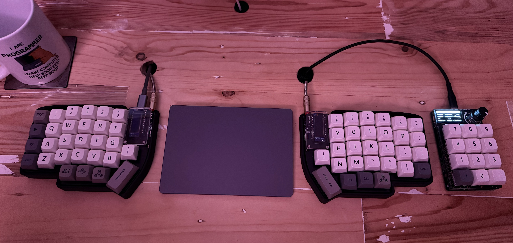
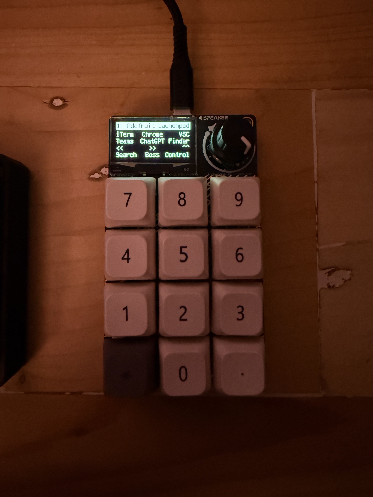
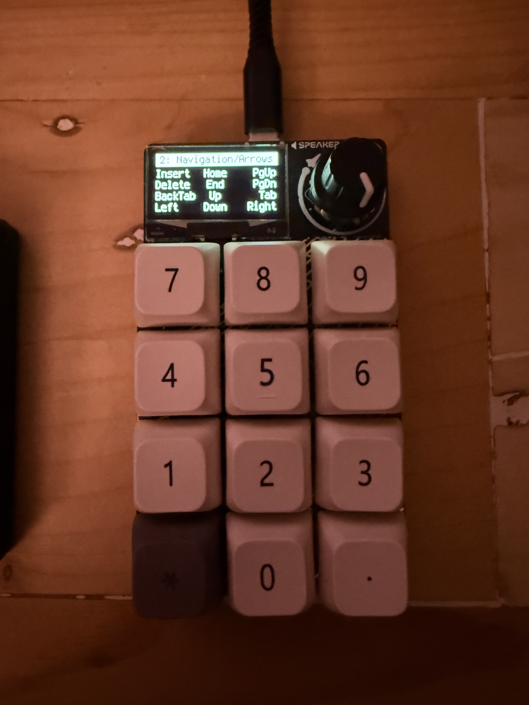

# My Adafruit Macropad set up





## Set up 1: Flash firmware

1. keep hold rotery encoder, click 'reset', keep holding rotery encode untill new drive mounts `RIP-RP2`
2. copy adafruit-circuitpython-adafruit_macropad_rp2040-en_US-9.2.1.uf2` file to it from https://circuitpython.org/board/adafruit_macropad_rp2040/

## Set up 2: set up macros

1. download [CircuitPython Bundle for Version 9.x](https://circuitpython.org/libraries)
2. copy the files from this repo onto the CIRCUITPI drive
    1. extract the libs from https://circuitpython.org/libraries 

```sh
.
├── README.md
├── boot.py
├── code.py
├── keyconfig.py
├── lib
│   ├── README.md
│   │   # get below from https://circuitpython.org/libraries
│   ├── adafruit_bitmap_font
│   ├── adafruit_debouncer.mpy
│   ├── adafruit_display_shapes
│   ├── adafruit_display_text
│   ├── adafruit_displayio_layout
│   ├── adafruit_hid
│   ├── adafruit_macropad.mpy
│   ├── adafruit_midi
│   ├── adafruit_pixelbuf.mpy
│   ├── adafruit_simple_text_display.mpy
│   ├── adafruit_ticks.mpy
│   └── neopixel.mpy
└── macros
    ├── 1-launch.py # Read the comments to add the shortcut keys to your MacOS
    ├── 2-navigation-arrows-keys.py
    ├── 3-numpad.py
    ├── 4-function-keys.py
    ├── 5-curlies.py
    ├── 6-media.py
    ├── 7-math.py
    ├── 8-accents.py
    ├── 9-mouse.py
    ├── A-teams.py
    ├── B-vsc.py
    ├── C-windows.py # Using Amethyst and Rectangle
    └── zzz_blank.py
```

## Trouble shooting

### My CIRCUITPY FS is read only

1. hit reset
2. hold the rotary encoder
3. see boot.py why that is

### Error: EROFS: read-only file system

> Failed to save 'some-file.py': Unable to write file '/Volumes/CIRCUITPY/some-file.py' (Unknown (FileSystemError): Error: EROFS: read-only file system, open '/Volumes/CIRCUITPY/some-file.py')

1. backup or copy off all files

2. connect to REPL in [MU Editor](https://learn.adafruit.com/adafruit-macropad-rp2040/installing-mu-editor) or via [`brew install --cask mu-editor`](https://formulae.brew.sh/cask/mu-editor)

```python
> > > import storage
> > > storage.erase_filesystem()
```

3. copy back all files

[resource](https://forums.adafruit.com/viewtopic.php?t=173164)

### My macro is not loading

See the 'Serial' Button in [MU Editor](https://learn.adafruit.com/adafruit-macropad-rp2040/installing-mu-editor):

```python
ERROR in B-vsc.py
Traceback (most recent call last):
  File "code.py", line 92, in <module>
  File "/macros/B-vsc.py", line 20, in <module>
AttributeError: type object 'Keycode' has no attribute 'SLASH'
```
